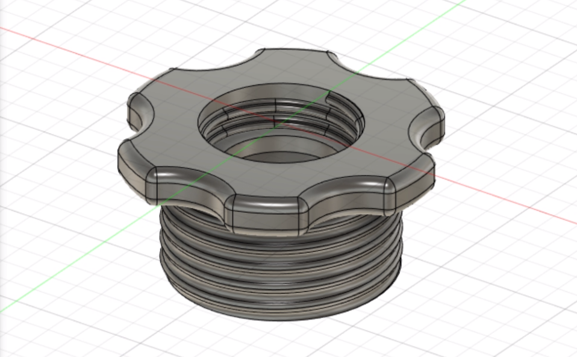
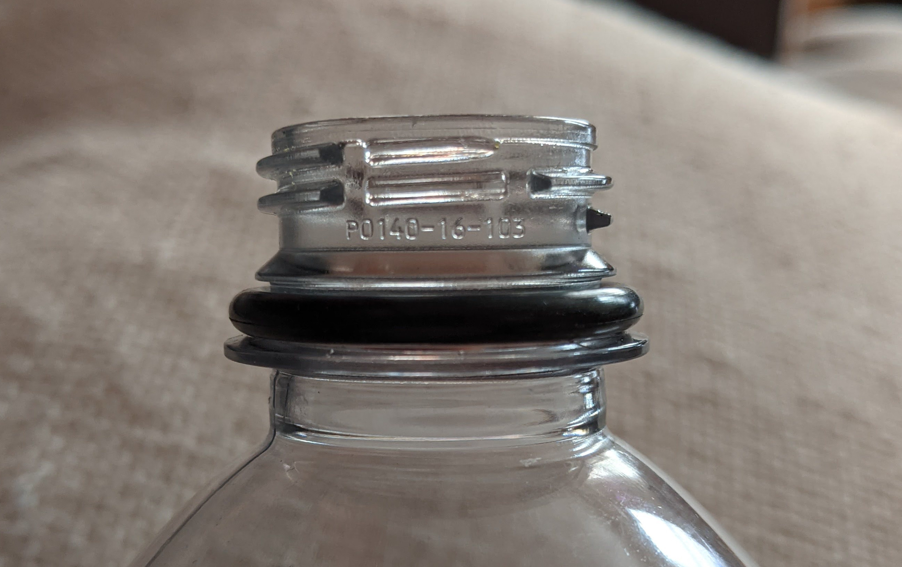

# BottleFilterAdapter

  

This component allows using water bottles / carbonated soft drink bottles to build homemade filters.

The threads on this design were created using information from [this specification](https://web.archive.org/web/20210329170423/https://www.isbt.com/assets/Threadspecs/pco1810.pdf).

## Overview

There are 2 common standards for plastic bottles - PCO-1810 and PCO-1881. The first is the older standard, and the second is the newer standard with a lower profile and less material.

Currently this design only works with PCO-1810, a PCO-1881 variant may be added later.

## Building

### Materials

1. The printed adapter
2. A plastic water bottle or soft drink bottle
3. A US #18 size o-ring (metric 1.78x18.77mm) (preferred) or glue / epoxy suitable for plastics

### Print Parameters

* Print Time: Approximately 1 hour 45 minutes
* Nozzle Size: 0.4mm
* Layer Height: 0.2mm
* Infill: 15%
* Supports: On build plate only (prevents support material in between threads, aiding with support removal)
* Walls: 2

### Assembly

1. Print the adapter in the default orientation - with the knob on the print surface.
2. Carefully remove all the support material from the bottle threads.
3. Remove the bottle cap safety seal from the bottle (the plastic ring that detaches from the cap when opening), and replace it with the o-ring. Alternatively, add glue to the bottle and adapter bottle threads.

  

4. Screw the bottle filter into the adapter until the o-ring is fully seated.

## Safety Warnings

* This design will not achieve a seal if an o-ring or glue is not used. Always test the seal to ensure your selection of o-ring/glue is effective.
