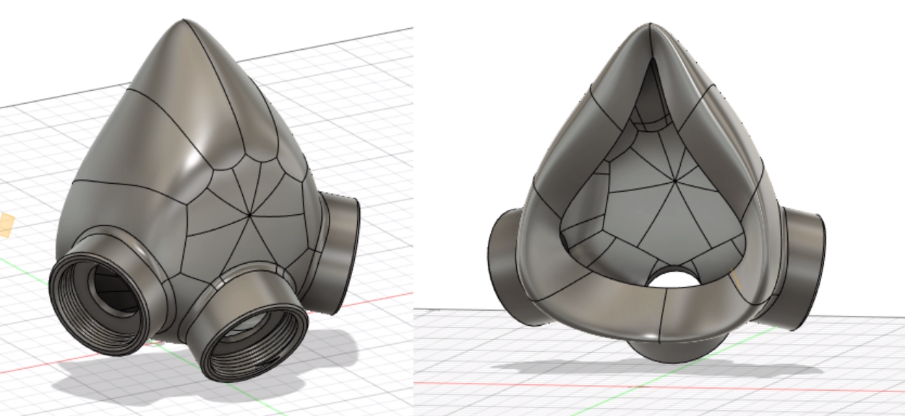

# SplineRespirator

  

This is a prototype half face respirator with 3 NATO ports. The aim of this design is to use silicone and a mold to form a better seal.

## Safety Warnings

* This design is not complete. Do not use it.
